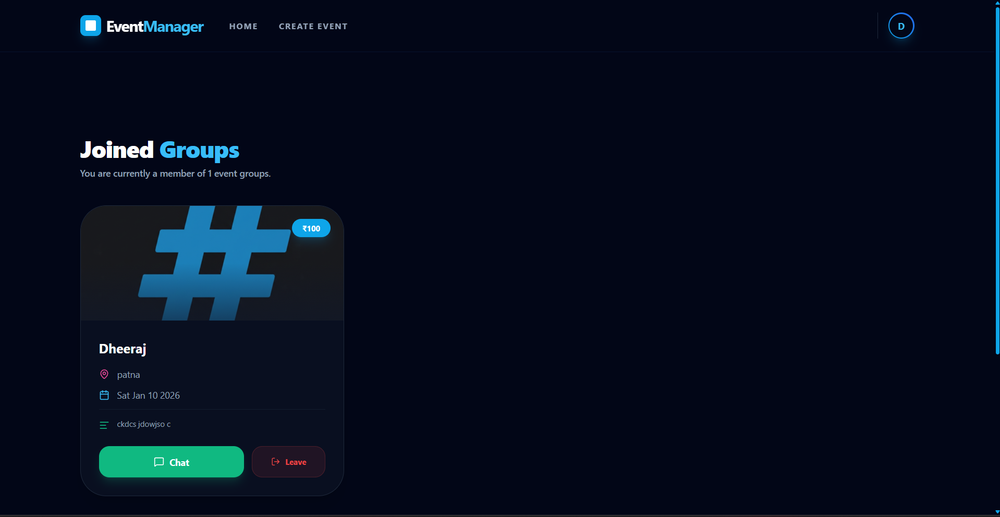

# 🎟️ EventManager – Event Management & Registration Platform  

*A full-stack web application for managing and attending events*

**EventManager** is a modern, role-based **event management system** that allows **organizers** to create and manage events while **users** can browse, register, and track them in real time.  
It is designed to be fast, scalable, and easy to use for both event creators and attendees.

---

## Application Screenshots

### Home
[](screenshots/home.png)

### Login
[](screenshots/login.png)

### Signup
[](screenshots/signup.png)

### My Creations
[](screenshots/my_creation.png)

### My Bookings
[](screenshots/mybooking.png)

### Event History
[](screenshots/history.png)

### Payment
[](screenshots/payment.png)

### Not Found
[](screenshots/notfound.png)

---

### Create Event
[](screenshots/eventcreate.png)

### Event Form
[](screenshots/eventform.png)

### Search Events
[](screenshots/searchevent.png)

### Join Event
[](screenshots/joinevent.png)

### Joined Confirmation
[](screenshots/joined_2.png)

---


## 🚀 Key Features  

### 🧑‍💼 1. Organizer Dashboard  
Organizers can:
- Create, update, and delete events  
- Upload event images & banners  
- View how many users have registered in real time  
- Manage event details from a single dashboard  

### 👥 2. User Experience  
Users can:
- Browse all available events  
- View full event details  
- Register for events  
- See live registration counts  

### 🔐 3. Authentication System  
- Secure user login & signup  
- Role-based access (Organizer / User)  
- Protected routes and dashboards  

### 📊 4. Real-Time Registration Updates  
- Event pages update automatically as users register  
- Organizers can see growing interest live  

### 🔔 5. Notification System *(In Progress)*  
- Upcoming event reminders  
- Registration deadline alerts  

---

## 🛠️ Tech Stack  

| Category  | Technologies Used |
|---------|------------------|
| Frontend | React.js, tailwind, Swiper.js, Firebase |
| Backend | Node.js, Express.js |
| Database | MongoDB, Mongoose |
| Auth & Forms | React Hook Form, Firebase Auth |
| File Uploads | Multer, Cloudinary |
| API & Networking | Axios |
| Utilities | Morgan, Dotenv, CORS |

---

## 📦 Frontend Dependencies  

```json
{
  "axios": "^1.7.7",
  "bootstrap": "^5.3.3",
  "firebase": "^12.7.0",
  "react": "^18.3.1",
  "react-dom": "^18.3.1",
  "react-hook-form": "^7.53.0",
  "react-router-dom": "^6.26.2",
  "swiper": "^12.0.3"
}
```

---

## 🧱 Backend Dependencies  

```json
{
  "bcryptjs": "^2.4.3",
  "cloudinary": "^2.8.0",
  "cors": "^2.8.5",
  "dotenv": "^16.4.5",
  "express": "^4.21.0",
  "mongoose": "^8.7.0",
  "morgan": "^1.10.1",
  "multer": "^2.0.2",
  "multer-storage-cloudinary": "^4.0.0",
  "nodemon": "^3.1.7"
}
```

---

## 📁 Project Structure  

```
eventmanager/
├── fronted/              # React Frontend
│   ├── components/
│   ├── pages/
│   ├── routes/
│   └── ...
├── backend/              # Node.js + Express Backend
│   ├── controllers/
│   ├── routes/
│   ├── models/
│   └── middleware/
├── .env
├── README.md
└── package.json
```

---

## ⚙️ Getting Started  

### Prerequisites  
- Node.js v20+  
- MongoDB (local or Atlas)  


---

### Installation  

```bash
# Clone repository
git clone https://github.com/your-username/eventmanager.git
cd eventmanager

# Setup frontend
cd fronted
npm install
npm run dev

# Setup backend
cd backend
npm install
nodemon
```

---

### Environment Variables  

Create a `.env` file in the backend folder:

```
MONGO_URI=your_mongodb_url
port = 4001
```

---

## 🧩 Future Enhancements  

- 🔔 Complete notification system  
- 💳 Payment integration for paid events  
- 📱 Mobile-friendly UI improvements  
- 🎫 QR-code based event check-in  
- 📊 Organizer analytics dashboard  

---

## 🏁 Conclusion  

**EventManager** makes organizing and attending events simple, fast, and digital.  
It brings together event creation, user registration, and real-time engagement into one powerful platform.

---

