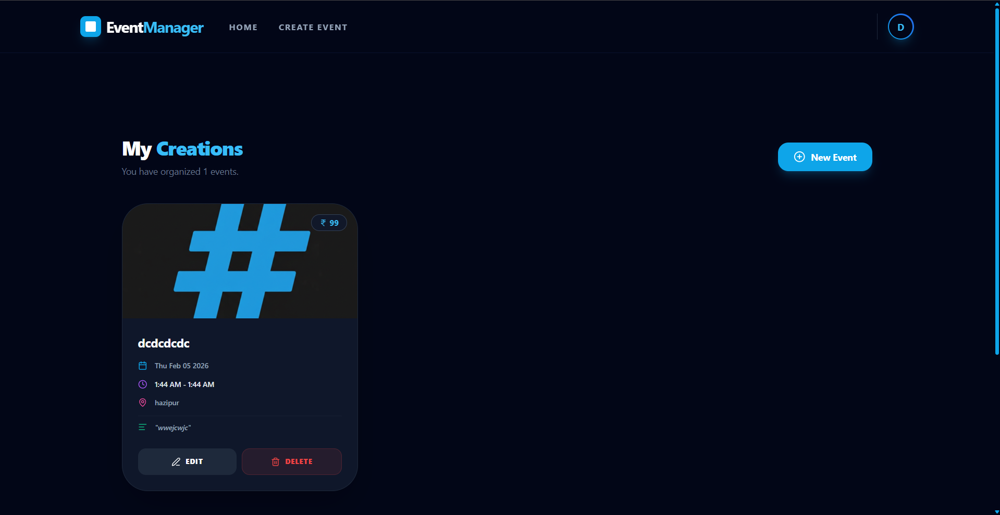
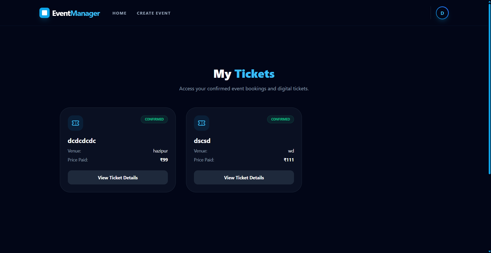
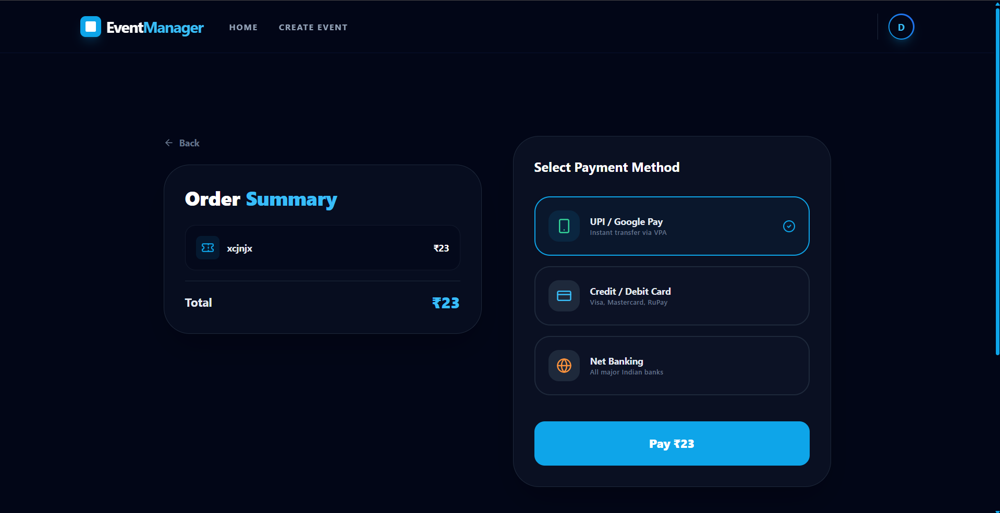

# 🎟️ EventManager – Event Management & Registration Platform  

*A full-stack web application for managing and attending events*

**EventManager** is a modern, role-based **event management system** that allows **organizers** to create and manage events while **users** can browse, register, and track them in real time.  
It is designed to be fast, scalable, and easy to use for both event creators and attendees.

---

<div align="center">

# ✨ Project Preview
<i>A glimpse of the core features, workflows, and UI experience</i>

<br/>

---

## 🏠 Core Experience

<table>
  <tr>
    <td align="center">
      
      <br/>
      <b>Home Page</b>
    </td>
    <td align="center">
      
      <br/>
      <b>Login</b>
    </td>
    <td align="center">
      
      <br/>
      <b>Sign Up</b>
    </td>
  </tr>
</table>

---

## 🎯 Event Creation & Discovery

<table>
  <tr>
    <td align="center">
      
      <br/>
      <b>Create Event</b>
    </td>
    <td align="center">
      
      <br/>
      <b>Event Details Form</b>
    </td>
    <td align="center">
      
      <br/>
      <b>Search Events</b>
    </td>
  </tr>
</table>

---

## 💳 Management & Payments

<table>
  <tr>
    <td align="center">
      
      <br/>
      <b>My Events</b>
    </td>
    <td align="center">
      
      <br/>
      <b>My Bookings</b>
    </td>
    <td align="center">
      
      <br/>
      <b>Secure Checkout</b>
    </td>
    <td align="center">
      
      <br/>
      <b>Payment History</b>
    </td>
  </tr>
</table>

---

## 🎨 UI Components

<table>
  <tr>
    <td align="center">
      
      <br/>
      <b>Sidebar Navigation</b>
    </td>
    <td align="center">
      
      <br/>
      <b>Join Event UI</b>
    </td>
    <td align="center">
      
      <br/>
      <b>404 Error Page</b>
    </td>
  </tr>
</table>

</div>


## 🚀 Key Features  

### 🧑‍💼 1. Organizer Dashboard  
Organizers can:
- Create, update, and delete events seamlessly  
- Upload event banners, thumbnails, and media assets  
- Monitor real-time user registrations and engagement  
- Manage event schedules, pricing, and availability  
- Access a centralized dashboard for full event control  

---

### 👥 2. User Experience  
Users can:
- Explore and browse upcoming and live events  
- View detailed event pages with images, schedules, and pricing  
- Register and participate in events instantly  
- Track their registered events and booking history  
- See live participant counts and event popularity  

---

### 🔐 3. Authentication & Security  
- Secure authentication using **Clerk, Google Auth, and Firebase Auth**  
- Role-based access control (Organizer / User)  
- Protected routes and restricted dashboards  
- Session management and secure API access  

---

### 💳 4. Payment Integration  
- Secure online payments powered by **Stripe**  
- Real-time payment confirmation  
- Test and production payment environments  
- Safe handling of sensitive payment data  

---

### 📊 5. Real-Time Updates  
- Live registration count updates without page refresh  
- Instant UI sync for organizers and users  
- Improved engagement through real-time feedback  

---

### 🔔 6. Notification System *(In Progress)*  
- Upcoming event reminders  
- Registration deadline alerts  
- Future support for email and push notifications  

---


## 🛠️ Tech Stack

| Category | Technologies Used |
|---------|------------------|
| Frontend | React.js, Tailwind CSS, Swiper.js, Firebase |
| Backend | Node.js, Express.js |
| Database | MongoDB, Mongoose |
| Authentication | Clerk, Google Auth, Firebase Auth |
| Forms | React Hook Form |
| File Uploads | Multer, Cloudinary |
| Payments | Stripe |
| API & Networking | Axios |
| Utilities | Morgan, Dotenv, CORS |


---

## 📦 Frontend Dependencies  

```json
{
    "@stripe/react-stripe-js": "^5.4.1",
    "@stripe/stripe-js": "^8.6.1",
    "axios": "^1.7.7",
    "bootstrap": "^5.3.3",
    "firebase": "^12.7.0",
    "lucide-react": "^0.562.0",
    "react": "^18.3.1",
    "react-dom": "^18.3.1",
    "react-hook-form": "^7.53.0",
    "react-router-dom": "^6.26.2",
    "swiper": "^12.0.3"
}
```

---

## 🧱 Backend Dependencies  

```json
{
    "bcryptjs": "^2.4.3",
    "cloudinary": "^2.8.0",
    "cors": "^2.8.5",
    "dotenv": "^16.6.1",
    "express": "^4.21.0",
    "mongoose": "^8.7.0",
    "morgan": "^1.10.1",
    "multer": "^2.0.2",
    "multer-storage-cloudinary": "^4.0.0",
    "nodemon": "^3.1.11",
    "stripe": "^20.2.0"
}
```

---

## 📁 Project Structure

```
eventmanager/
├── Backend/                 # Node.js API
│   ├── config/              # Database configuration (db.js)
│   ├── controller/          # Logic (event, payment, user)
│   ├── model/               # Schemas (booking, event, user)
│   ├── route/               # API Endpoints
│   ├── uploads/             # Local file storage
│   ├── .env                 # Backend secrets
│   └── index.js             # Server entry point
├── Frontend/                # React (Vite)
│   ├── src/
│   │   ├── assets/          # Static assets
│   │   ├── components/      # Reusable UI
│   │   ├── context/         # Global state management
│   │   ├── pages/           # App screens
│   │   └── App.jsx          # Main component
│   ├── .env                 # Frontend public keys
│   └── index.html           # Entry HTML
└── screenshots/             # App preview images
```

---

## ⚙️ Getting Started  

## ✅ Prerequisites

- Node.js v20+
- MongoDB (Local or Atlas)
- Stripe Account

---

## 🚀 Installation

```bash

# Clone repository
git clone https://github.com/Dheeraj23qw/mangment.git
cd eventmanager

# Frontend setup
cd Frontend
npm install
npm run dev

# Backend setup
cd Backend
npm install
nodemon

---

### Environment Variables  

Create a `.env` file in the backend folder:


PORT=4001
MONGO_URI=mongodb://127.0.0.1:27017/eventmanager
STRIPE_SECRET_KEY=sk_test_yourStripeSecretKeyHere

Create a `.env` file in the fronted folder:


VITE_STRIPE_PUBLISHABLE_KEY=pk_test_yourStripePublishableKeyHere


## 🧩 Future Enhancements  

- 🔔 Complete notification system  
- 📱 Mobile-friendly UI improvements  
- 🎫 QR-code based event check-in  
- 📊 Organizer analytics dashboard  

---

## 🏁 Conclusion  

**EventManager** makes organizing and attending events simple, fast, and digital.  
It brings together event creation, user registration, and real-time engagement into one powerful platform.

---

